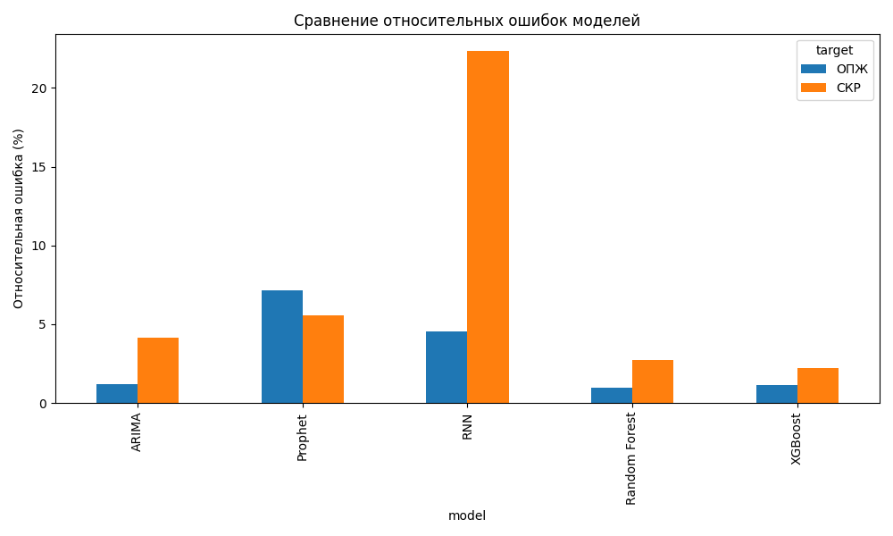

# Отчёт по моделям
## Модель: ARIMA — СКР
```
====================================================================================================
File: ./notebooks/ARIMA/predictions_afr.xlsx
Names standardize
RMSE: 0.0593
MAE: 0.0445
R²: 0.9544
Средний СКР: 1.4329
Среднее по предсказаниям: 0     1.236
1     1.437
2     1.434
3     1.613
4     1.074
      ...  
80    1.990
81    1.275
82    1.461
83    1.254
84    0.996
Name: predictions, Length: 85, dtype: float64
Относительная ошибка: 4.14%
====================================================================================================
Отклонение таргета относительно среднего по всем годам: 1.62
RMSE: 0.3348
MAE: 0.2725
R²: -0.4538
Средний СКР: 1.4329
Относительная ошибка: 23.37%
====================================================================================================
JSON: {"RMSE": 0.05926621495670294, "MAE": 0.04445411764705883, "R2": 0.9544499972734612, "mean": 1.4329270588235294, "relative_error": 4.136024551407526}
```

## Модель: ARIMA — ОПЖ
```
====================================================================================================
File: ./notebooks/ARIMA/predictions_ele.xlsx
Names standardize
RMSE: 0.8804
MAE: 0.7063
R²: 0.8856
Средний ОПЖ: 72.4341
Среднее по предсказаниям: 0     71.6454
1     69.7642
2     71.8364
3     73.6969
4     74.6611
       ...   
80    74.6480
81    73.3106
82    78.8378
83    77.2032
84    74.6973
Name: predictions, Length: 85, dtype: float64
Относительная ошибка: 1.22%
====================================================================================================
Отклонение таргета относительно среднего по всем годам: 71.29
RMSE: 2.8435
MAE: 2.1326
R²: -0.1932
Средний ОПЖ: 72.4341
Относительная ошибка: 3.93%
====================================================================================================
JSON: {"RMSE": 0.880369612552525, "MAE": 0.7062552941176471, "R2": 0.8856220471199727, "mean": 72.43411764705881, "relative_error": 1.2154073814251432}
```

## Модель: Prophet — СКР
```
====================================================================================================
File: ./notebooks/Prophet/predictions_afr.xlsx
Names standardize
RMSE: 0.0804
MAE: 0.0626
R²: 0.9166
Средний СКР: 1.4430
Среднее по предсказаниям: 0      1.164096
1      1.112022
2      1.204664
3      1.151042
4      1.144018
         ...   
165    1.849409
166    1.612739
167    1.567077
168    1.597878
169    1.539894
Name: predictions, Length: 170, dtype: float64
Относительная ошибка: 5.57%
====================================================================================================
Отклонение таргета относительно среднего по всем годам: 1.62
RMSE: 0.3299
MAE: 0.2663
R²: -0.4045
Средний СКР: 1.4430
Относительная ошибка: 22.86%
====================================================================================================
JSON: {"RMSE": 0.08039634474917264, "MAE": 0.06261784104002265, "R2": 0.9165793307910134, "mean": 1.4429705882352941, "relative_error": 5.57158582473221}
```

## Модель: Prophet — ОПЖ
```
====================================================================================================
File: ./notebooks/Prophet/predictions_ele.xlsx
Names standardize
RMSE: 5.1509
MAE: 4.8807
R²: -3.2340
Средний ОПЖ: 72.1126
Среднее по предсказаниям: 0      68.930292
1      67.163997
2      66.795425
3      65.002477
4      66.478720
         ...    
165    66.867216
166    65.778662
167    65.123201
168    65.750091
169    66.060421
Name: predictions, Length: 170, dtype: float64
Относительная ошибка: 7.14%
====================================================================================================
Отклонение таргета относительно среднего по всем годам: 71.29
RMSE: 2.6350
MAE: 1.9764
R²: -0.1080
Средний ОПЖ: 72.1126
Относительная ошибка: 3.65%
====================================================================================================
JSON: {"RMSE": 5.150934069517236, "MAE": 4.880674739778387, "R2": -3.233954240499953, "mean": 72.11264705882353, "relative_error": 7.142899726473126}
```

## Модель: Random Forest — СКР
```
====================================================================================================
File: ./notebooks/Random Forest/predictions_afr.xlsx
Names standardize
RMSE: 0.0393
MAE: 0.0292
R²: 0.9796
Средний СКР: 1.4365
Среднее по предсказаниям: 0     1.263873
1     1.487521
2     1.435683
3     1.596300
4     1.061278
        ...   
80    1.948799
81    1.281521
82    1.401913
83    1.245389
84    1.061944
Name: predictions, Length: 85, dtype: float64
Относительная ошибка: 2.74%
====================================================================================================
Отклонение таргета относительно среднего по всем годам: 1.62
RMSE: 0.3311
MAE: 0.2689
R²: -0.4436
Средний СКР: 1.4365
Относительная ошибка: 23.05%
====================================================================================================
JSON: {"RMSE": 0.03932620591272432, "MAE": 0.029168101179533782, "R2": 0.9796317627567215, "mean": 1.4364705882352944, "relative_error": 2.7376965623108656}
```

## Модель: Random Forest — ОПЖ
```
====================================================================================================
File: ./notebooks/Random Forest/predictions_ele.xlsx
Names standardize
RMSE: 0.6832
MAE: 0.5865
R²: 0.9311
Средний ОПЖ: 72.4341
Среднее по предсказаниям: 0     70.067919
1     68.086430
2     70.542250
3     71.398976
4     72.966648
        ...    
80    74.826673
81    70.942656
82    78.228405
83    76.495689
84    76.028515
Name: predictions, Length: 85, dtype: float64
Относительная ошибка: 0.94%
====================================================================================================
Отклонение таргета относительно среднего по всем годам: 71.29
RMSE: 2.8435
MAE: 2.1326
R²: -0.1932
Средний ОПЖ: 72.4341
Относительная ошибка: 3.93%
====================================================================================================
JSON: {"RMSE": 0.6831684827920756, "MAE": 0.5864823301127474, "R2": 0.931124006433729, "mean": 72.43411764705881, "relative_error": 0.9431584244884023}
```

## Модель: XGBoost — СКР
```
====================================================================================================
File: ./notebooks/XGBoost/predictions_afr.xlsx
Names standardize
RMSE: 0.0316
MAE: 0.0240
R²: 0.9869
Средний СКР: 1.4365
Среднее по предсказаниям: 0     1.275319
1     1.469693
2     1.415623
3     1.612055
4     1.098972
        ...   
80    1.929945
81    1.305664
82    1.406165
83    1.255955
84    1.051260
Name: predictions, Length: 85, dtype: float64
Относительная ошибка: 2.20%
====================================================================================================
Отклонение таргета относительно среднего по всем годам: 1.62
RMSE: 0.3311
MAE: 0.2689
R²: -0.4436
Средний СКР: 1.4365
Относительная ошибка: 23.05%
====================================================================================================
JSON: {"RMSE": 0.031577557563355854, "MAE": 0.023965081697351762, "R2": 0.9868675299764527, "mean": 1.4364705882352944, "relative_error": 2.1982738680468854}
```

## Модель: XGBoost — ОПЖ
```
====================================================================================================
File: ./notebooks/XGBoost/predictions_ele.xlsx
Names standardize
RMSE: 0.8215
MAE: 0.7429
R²: 0.9004
Средний ОПЖ: 72.4341
Среднее по предсказаниям: 0     70.154984
1     68.059189
2     70.703369
3     71.283707
4     72.933205
        ...    
80    74.653893
81    70.975227
82    77.412392
83    75.953690
84    75.444801
Name: predictions, Length: 85, dtype: float64
Относительная ошибка: 1.13%
====================================================================================================
Отклонение таргета относительно среднего по всем годам: 71.29
RMSE: 2.8435
MAE: 2.1326
R²: -0.1932
Средний ОПЖ: 72.4341
Относительная ошибка: 3.93%
====================================================================================================
JSON: {"RMSE": 0.8214864661036654, "MAE": 0.7429433773265169, "R2": 0.9004106133538248, "mean": 72.43411764705881, "relative_error": 1.1341153765500749}
```

## Диаграмма относительных ошибок

