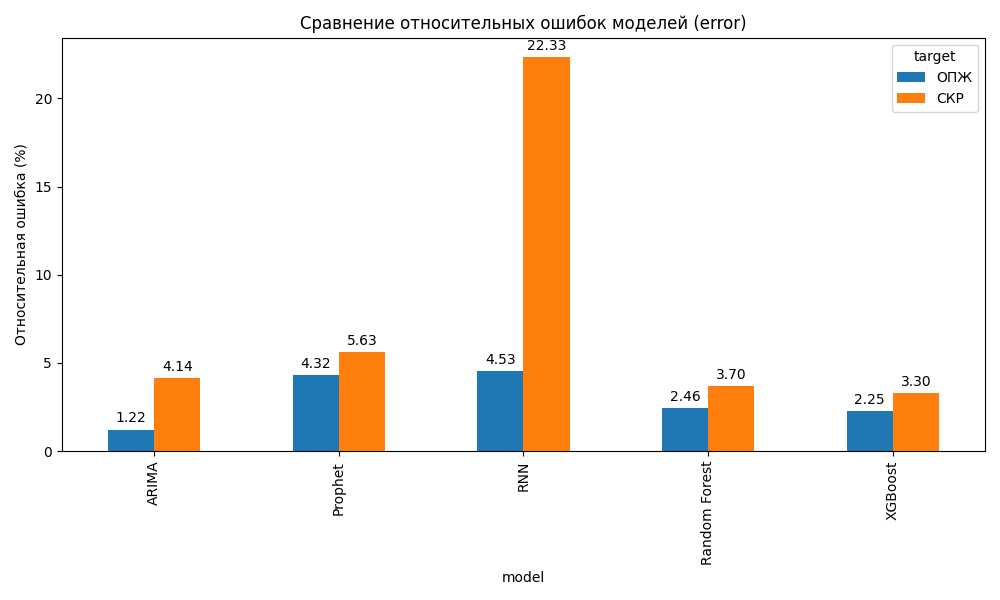
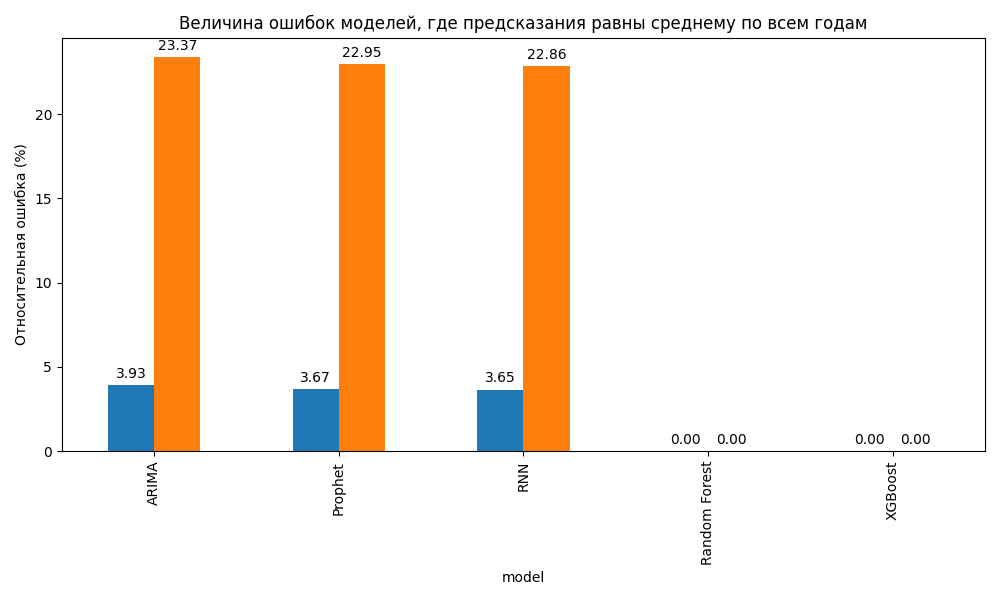

# Отчёт по моделям
## Модель: ARIMA — СКР
```
====================================================================================================
Отклонение таргета относительно прогноза:
RMSE: 0.0593
MAE: 0.0445
R²: 0.9544
Средний СКР: 1.4329
Относительная ошибка: 4.14%
====================================================================================================
Отклонение таргета относительно СРЕДНЕГО:
RMSE: 0.3348
MAE: 0.2725
R²: -0.4538
Средний СКР: 1.4329
Относительная ошибка: 23.37%
====================================================================================================
{"RMSE": 0.05926621495670294, "MAE": 0.04445411764705883, "R2": 0.9544499972734612, "relative_error": 4.136024551407526, "relative_average": 23.366633676905913}
```

## Модель: ARIMA — ОПЖ
```
====================================================================================================
Отклонение таргета относительно прогноза:
RMSE: 0.8804
MAE: 0.7063
R²: 0.8856
Средний ОПЖ: 72.4341
Относительная ошибка: 1.22%
====================================================================================================
Отклонение таргета относительно СРЕДНЕГО:
RMSE: 2.8435
MAE: 2.1326
R²: -0.1932
Средний ОПЖ: 72.4341
Относительная ошибка: 3.93%
====================================================================================================
{"RMSE": 0.880369612552525, "MAE": 0.7062552941176471, "R2": 0.8856220471199727, "relative_error": 1.2154073814251432, "relative_average": 3.9255724713872944}
```

## Модель: Prophet — СКР
```
====================================================================================================
Отклонение таргета относительно прогноза:
RMSE: 0.0813
MAE: 0.0636
R²: 0.9158
Средний СКР: 1.4432
Относительная ошибка: 5.63%
====================================================================================================
Отклонение таргета относительно СРЕДНЕГО:
RMSE: 0.3312
MAE: 0.2672
R²: -0.3989
Средний СКР: 1.4432
Относительная ошибка: 22.95%
====================================================================================================
{"RMSE": 0.0812716464167795, "MAE": 0.06364434410253696, "R2": 0.915751869343397, "relative_error": 5.631526746965954, "relative_average": 22.947746449726324}
```

## Модель: Prophet — ОПЖ
```
====================================================================================================
Отклонение таргета относительно прогноза:
RMSE: 3.1182
MAE: 1.9576
R²: -0.5340
Средний ОПЖ: 72.1096
Относительная ошибка: 4.32%
====================================================================================================
Отклонение таргета относительно СРЕДНЕГО:
RMSE: 2.6477
MAE: 1.9871
R²: -0.1060
Средний ОПЖ: 72.1096
Относительная ошибка: 3.67%
====================================================================================================
{"RMSE": 3.1182167851107914, "MAE": 1.9576427501147977, "R2": -0.5340055812229811, "relative_error": 4.32427156973766, "relative_average": 3.6717662954718566}
```

## Модель: Random Forest — СКР
```
Traceback (most recent call last):
  File "/var/lib/jenkins/workspace/Check accuracy/venv/lib/python3.12/site-packages/pandas/core/indexes/base.py", line 3812, in get_loc
    return self._engine.get_loc(casted_key)
           ^^^^^^^^^^^^^^^^^^^^^^^^^^^^^^^^
  File "pandas/_libs/index.pyx", line 167, in pandas._libs.index.IndexEngine.get_loc
  File "pandas/_libs/index.pyx", line 196, in pandas._libs.index.IndexEngine.get_loc
  File "pandas/_libs/hashtable_class_helper.pxi", line 7088, in pandas._libs.hashtable.PyObjectHashTable.get_item
  File "pandas/_libs/hashtable_class_helper.pxi", line 7096, in pandas._libs.hashtable.PyObjectHashTable.get_item
KeyError: 'СКР'

The above exception was the direct cause of the following exception:

Traceback (most recent call last):
  File "/var/lib/jenkins/workspace/Check accuracy/check_metrics.py", line 147, in <module>
    main()
  File "/var/lib/jenkins/workspace/Check accuracy/check_metrics.py", line 93, in main
    mask = ~np.isnan(df[args.target]) & ~np.isnan(df['predictions'])
                     ~~^^^^^^^^^^^^^
  File "/var/lib/jenkins/workspace/Check accuracy/venv/lib/python3.12/site-packages/pandas/core/frame.py", line 4113, in __getitem__
    indexer = self.columns.get_loc(key)
              ^^^^^^^^^^^^^^^^^^^^^^^^^
  File "/var/lib/jenkins/workspace/Check accuracy/venv/lib/python3.12/site-packages/pandas/core/indexes/base.py", line 3819, in get_loc
    raise KeyError(key) from err
KeyError: 'СКР'
```

## Модель: Random Forest — ОПЖ
```
Traceback (most recent call last):
  File "/var/lib/jenkins/workspace/Check accuracy/venv/lib/python3.12/site-packages/pandas/core/indexes/base.py", line 3812, in get_loc
    return self._engine.get_loc(casted_key)
           ^^^^^^^^^^^^^^^^^^^^^^^^^^^^^^^^
  File "pandas/_libs/index.pyx", line 167, in pandas._libs.index.IndexEngine.get_loc
  File "pandas/_libs/index.pyx", line 196, in pandas._libs.index.IndexEngine.get_loc
  File "pandas/_libs/hashtable_class_helper.pxi", line 7088, in pandas._libs.hashtable.PyObjectHashTable.get_item
  File "pandas/_libs/hashtable_class_helper.pxi", line 7096, in pandas._libs.hashtable.PyObjectHashTable.get_item
KeyError: 'ОПЖ'

The above exception was the direct cause of the following exception:

Traceback (most recent call last):
  File "/var/lib/jenkins/workspace/Check accuracy/check_metrics.py", line 147, in <module>
    main()
  File "/var/lib/jenkins/workspace/Check accuracy/check_metrics.py", line 93, in main
    mask = ~np.isnan(df[args.target]) & ~np.isnan(df['predictions'])
                     ~~^^^^^^^^^^^^^
  File "/var/lib/jenkins/workspace/Check accuracy/venv/lib/python3.12/site-packages/pandas/core/frame.py", line 4113, in __getitem__
    indexer = self.columns.get_loc(key)
              ^^^^^^^^^^^^^^^^^^^^^^^^^
  File "/var/lib/jenkins/workspace/Check accuracy/venv/lib/python3.12/site-packages/pandas/core/indexes/base.py", line 3819, in get_loc
    raise KeyError(key) from err
KeyError: 'ОПЖ'
```

## Модель: RNN — СКР
```
====================================================================================================
Отклонение таргета относительно прогноза:
RMSE: 0.3222
MAE: 0.2514
R²: -0.3402
Средний СКР: 1.4430
Относительная ошибка: 22.33%
====================================================================================================
Отклонение таргета относительно СРЕДНЕГО:
RMSE: 0.3299
MAE: 0.2663
R²: -0.4045
Средний СКР: 1.4430
Относительная ошибка: 22.86%
====================================================================================================
{"RMSE": 0.3222381223996383, "MAE": 0.25142352362801046, "R2": -0.3401545911682544, "relative_error": 22.331579384007057, "relative_average": 22.86120035365979}
```

## Модель: RNN — ОПЖ
```
====================================================================================================
Отклонение таргета относительно прогноза:
RMSE: 3.2670
MAE: 2.6163
R²: -0.7032
Средний ОПЖ: 72.1126
Относительная ошибка: 4.53%
====================================================================================================
Отклонение таргета относительно СРЕДНЕГО:
RMSE: 2.6350
MAE: 1.9764
R²: -0.1080
Средний ОПЖ: 72.1126
Относительная ошибка: 3.65%
====================================================================================================
{"RMSE": 3.2670192967283587, "MAE": 2.6162766813390395, "R2": -0.7032467821757102, "relative_error": 4.530438737137739, "relative_average": 3.6540144304911046}
```

## Модель: XGBoost — СКР
```
Traceback (most recent call last):
  File "/var/lib/jenkins/workspace/Check accuracy/venv/lib/python3.12/site-packages/pandas/core/indexes/base.py", line 3812, in get_loc
    return self._engine.get_loc(casted_key)
           ^^^^^^^^^^^^^^^^^^^^^^^^^^^^^^^^
  File "pandas/_libs/index.pyx", line 167, in pandas._libs.index.IndexEngine.get_loc
  File "pandas/_libs/index.pyx", line 196, in pandas._libs.index.IndexEngine.get_loc
  File "pandas/_libs/hashtable_class_helper.pxi", line 7088, in pandas._libs.hashtable.PyObjectHashTable.get_item
  File "pandas/_libs/hashtable_class_helper.pxi", line 7096, in pandas._libs.hashtable.PyObjectHashTable.get_item
KeyError: 'СКР'

The above exception was the direct cause of the following exception:

Traceback (most recent call last):
  File "/var/lib/jenkins/workspace/Check accuracy/check_metrics.py", line 147, in <module>
    main()
  File "/var/lib/jenkins/workspace/Check accuracy/check_metrics.py", line 93, in main
    mask = ~np.isnan(df[args.target]) & ~np.isnan(df['predictions'])
                     ~~^^^^^^^^^^^^^
  File "/var/lib/jenkins/workspace/Check accuracy/venv/lib/python3.12/site-packages/pandas/core/frame.py", line 4113, in __getitem__
    indexer = self.columns.get_loc(key)
              ^^^^^^^^^^^^^^^^^^^^^^^^^
  File "/var/lib/jenkins/workspace/Check accuracy/venv/lib/python3.12/site-packages/pandas/core/indexes/base.py", line 3819, in get_loc
    raise KeyError(key) from err
KeyError: 'СКР'
```

## Модель: XGBoost — ОПЖ
```
Traceback (most recent call last):
  File "/var/lib/jenkins/workspace/Check accuracy/venv/lib/python3.12/site-packages/pandas/core/indexes/base.py", line 3812, in get_loc
    return self._engine.get_loc(casted_key)
           ^^^^^^^^^^^^^^^^^^^^^^^^^^^^^^^^
  File "pandas/_libs/index.pyx", line 167, in pandas._libs.index.IndexEngine.get_loc
  File "pandas/_libs/index.pyx", line 196, in pandas._libs.index.IndexEngine.get_loc
  File "pandas/_libs/hashtable_class_helper.pxi", line 7088, in pandas._libs.hashtable.PyObjectHashTable.get_item
  File "pandas/_libs/hashtable_class_helper.pxi", line 7096, in pandas._libs.hashtable.PyObjectHashTable.get_item
KeyError: 'ОПЖ'

The above exception was the direct cause of the following exception:

Traceback (most recent call last):
  File "/var/lib/jenkins/workspace/Check accuracy/check_metrics.py", line 147, in <module>
    main()
  File "/var/lib/jenkins/workspace/Check accuracy/check_metrics.py", line 93, in main
    mask = ~np.isnan(df[args.target]) & ~np.isnan(df['predictions'])
                     ~~^^^^^^^^^^^^^
  File "/var/lib/jenkins/workspace/Check accuracy/venv/lib/python3.12/site-packages/pandas/core/frame.py", line 4113, in __getitem__
    indexer = self.columns.get_loc(key)
              ^^^^^^^^^^^^^^^^^^^^^^^^^
  File "/var/lib/jenkins/workspace/Check accuracy/venv/lib/python3.12/site-packages/pandas/core/indexes/base.py", line 3819, in get_loc
    raise KeyError(key) from err
KeyError: 'ОПЖ'
```

## Диаграмма относительных ошибок


